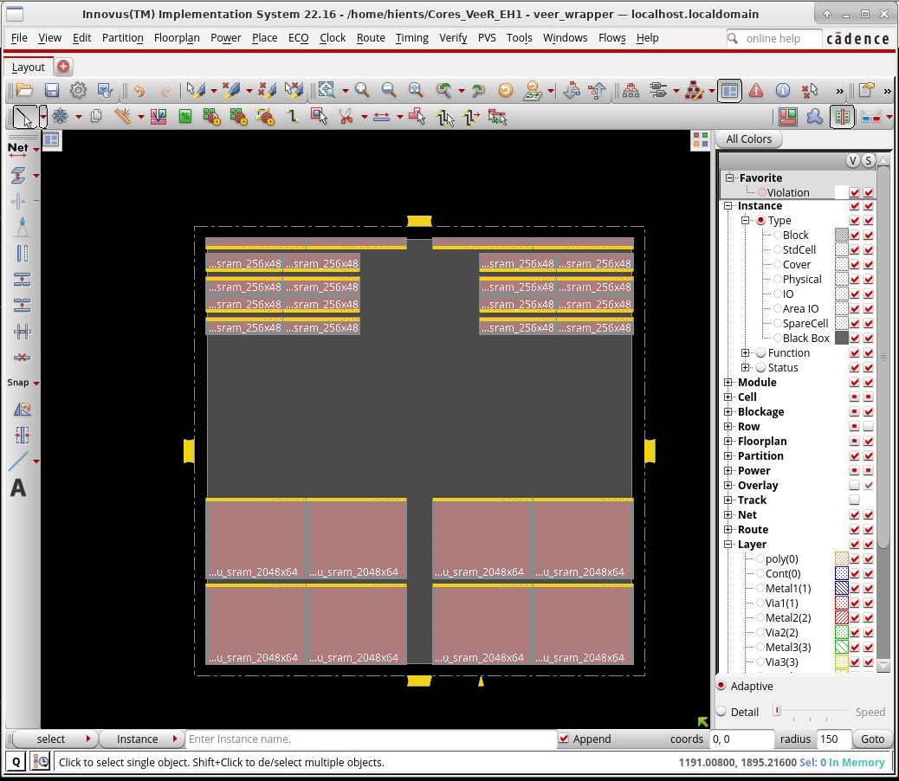
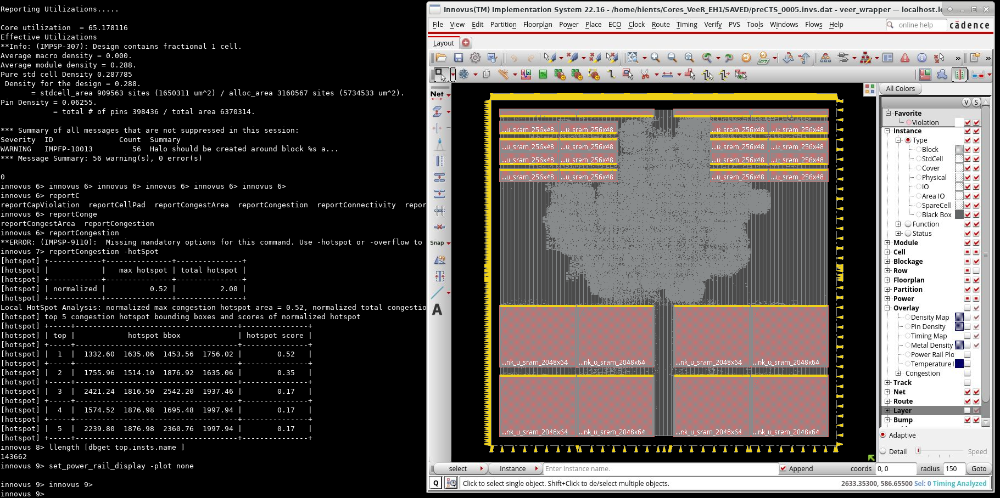
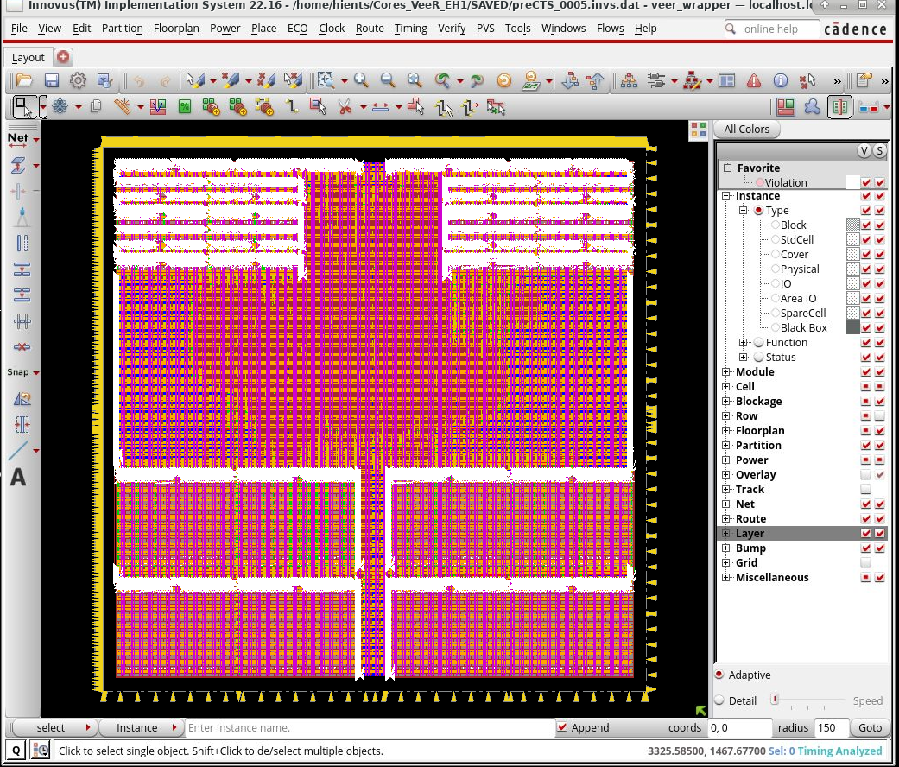
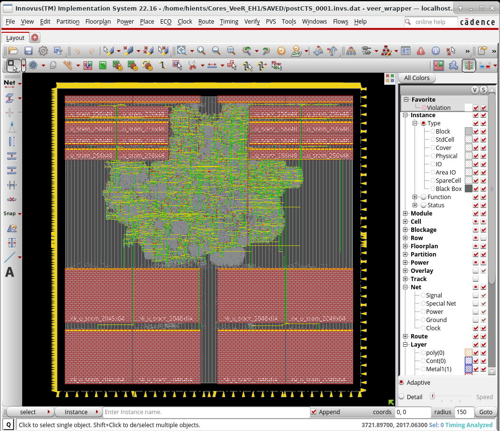
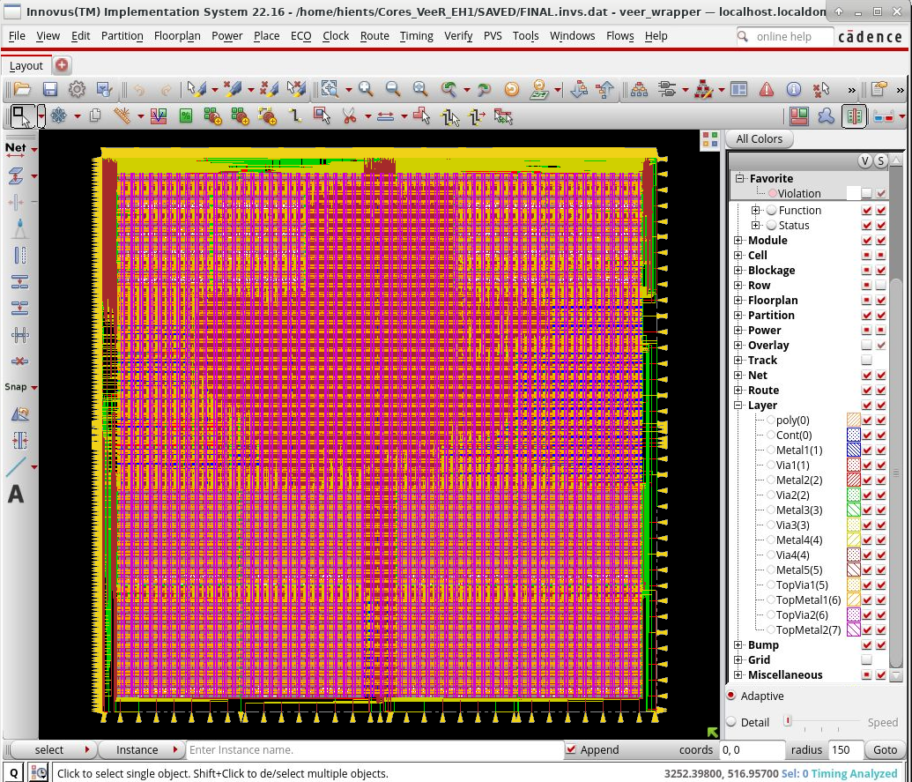
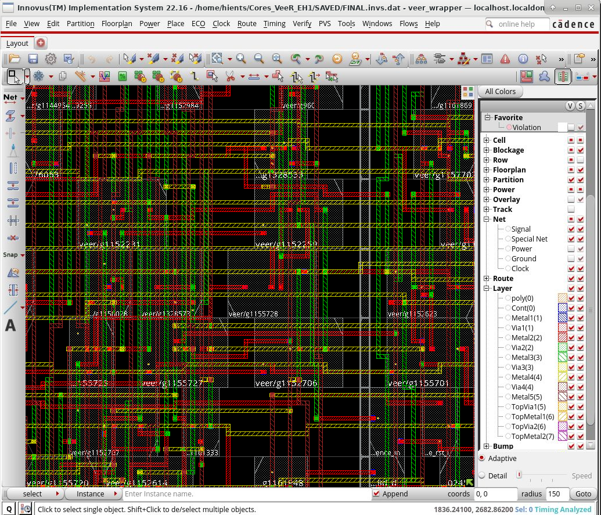
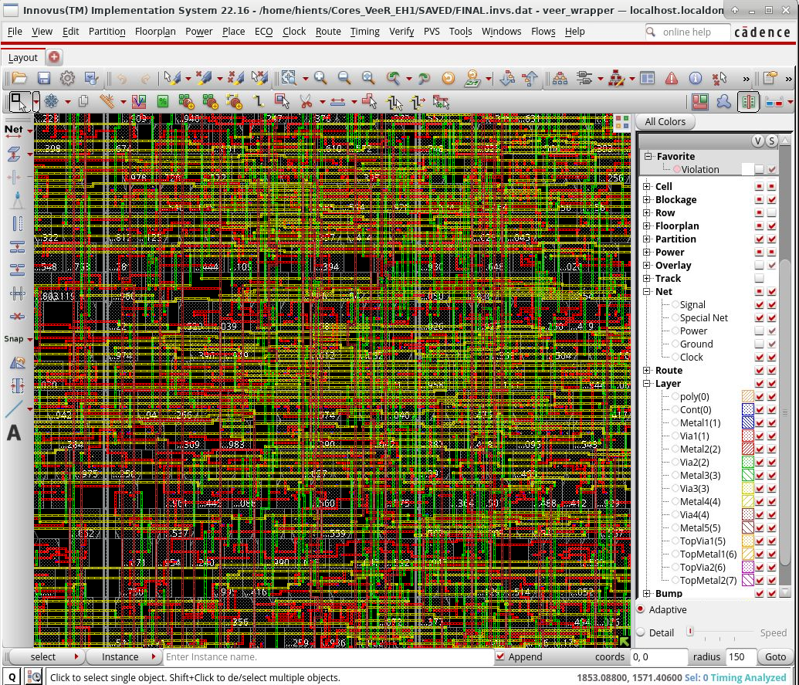
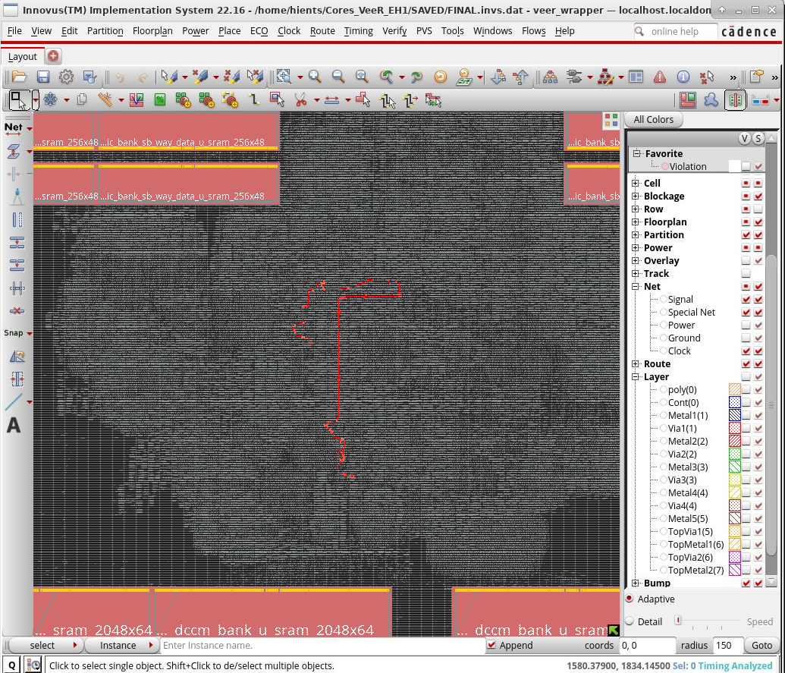
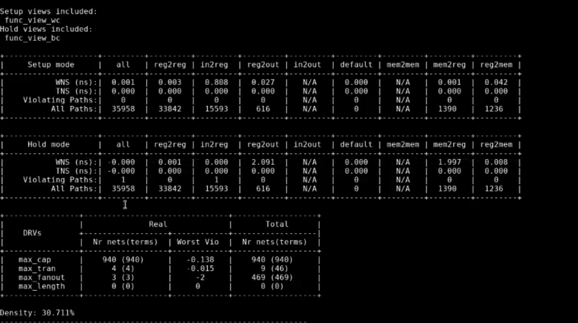

# 🚀 Cores_VeeR_EH1 Physical Design Implementation

A complete Physical Design (PnR) implementation of **Cores_VeeR_EH1** (industrial-grade 32-bit RISC-V core), from synthesized netlist to final routed handoff artifacts.

> 🔐 **Reference-only scope:** This project is shared for learning/documentation. Proprietary technology files (PDK/libs/LEF/script collateral) are intentionally excluded from public upload.

---

## 📦 Environment & Technologies

- **Top design:** `veer_wrapper`
- **RTL language:** SystemVerilog
- **Technology node:** IHP SG13G2 (130nm)
- **Supply:** 1.2V core, 3.3V I/O
- **Target clocks:**
  - `clk_sys`: 10 ns (100 MHz)
  - `clk_jtg` (`jtag_tck`): 20 ns (50 MHz)
- **Clock uncertainty:** 0.1 ns (setup/hold)
- **Synthesis tool:** Cadence Genus 22.16
- **P&R tool:** Cadence Innovus 22.16

✅ This README is self-contained for GitHub publishing and includes all key implementation details directly.

---

## ⚙️ Implementation Highlights

What makes this implementation robust:

- 🧠 **Macro-aware floorplanning:** SRAM-heavy organization with routing-channel considerations.
- ⚡ **Power + physical infrastructure:** physical-only cell usage (tap/endcap/tie) captured in implementation statistics.
- 🕒 **Balanced timing flow:** setup closure achieved with near-zero hold margin context.
- 🛣️ **Routing quality:** final routed database with clean DRC snapshot in included results.
- 📊 **Evidence-driven signoff:** quantitative timing/congestion/DRV summaries included below.

---

## 📐 Design Constraints & Target PPA

### 1) Constraint Model

- Units: ns / pF / V / mA
- Output load: `set_load 0.01 [all_outputs]`
- Input driver model: `sg13g2_buf_16`
- Clocks:
  - `create_clock -name clk_sys -period 10.0 [get_ports clk]`
  - `create_clock -name clk_jtg -period 20.0 [get_ports jtag_tck]`
- Async groups:
  - `set_clock_groups -asynchronous ... -group {clk_sys} -group {clk_jtg}`
- Uncertainty/transition:
  - `set_clock_uncertainty 0.1 -setup/-hold [all_clocks]`
  - `set_clock_transition 0.20 [all_clocks]`
- Reset/JTAG/system IO min/max delays constrained.

### 2) Target Intent

| Metric | Target / Intent | Notes |
| :--- | :--- | :--- |
| **System Clock** | **100 MHz (10 ns)** | Main timing target |
| **JTAG Clock** | **50 MHz (20 ns)** | Async to system domain |
| **Core Utilization** | ~65% observed | Macro-heavy design context |
| **Routing Layers** | Metal1–Metal5 + TopMetal1/2 | 7 routed layers |
| **Goal** | Setup closure + clean DRC | Hold near-zero context tracked |

---

## 🧩 Detailed Project Specifications

### 2.1 Design Composition

- **Total instances:** 158,570
- **Standard cells:** 158,542
- **Hard macros:** 28
- **Total signal nets:** 136,219 (+2 special nets)

Cell mix highlights (from Innovus summary):

- Flip-flops (`dfrbp` + `sdfbbp`): ~14,081
- Buffers (all strengths): ~20,316
- Inverters (all strengths): ~12,479
- MUX2: ~4,589
- Tie cells: 1,136
- Well tap + endcap: 41,143

### 2.2 Macro Breakdown

| Macro | Instances | Area (um²) | Core Share |
|---|---:|---:|---:|
| `RM_IHPSG13_1P_2048x64_c2_bm_bist` | 8 | 3,933,068.928 | 34.028% |
| `RM_IHPSG13_1P_256x48_c2_bm_bist` | 16 | 1,133,598.310 | 9.808% |
| `RM_IHPSG13_1P_64x64_c2_bm_bist` | 4 | 201,956.531 | 1.747% |

**Total macro area:** ~5,268,623 um² (~45.58% of core area)

---

## 🦉 Process, Challenges & Quantitative Results

This section combines the implementation journey with measurable results at each stage.

### Stage 1) Data Prep & Synthesis (Genus)

1. **What was done:** RTL read/elaboration + mapping/optimization.
2. **Challenge:** Ensure clean handoff for physical implementation.
3. **Result:** Netlist handoff used as input for PnR stages.

### Stage 2) Floorplan / Initialization (`00_init_design`)

1. **What was done:** Die/core setup and macro-aware initialization.

   

2. **Challenge:** Macro-heavy topology (SRAMs) constrains routing channels.
3. **Quantitative results:**
   - Die area: ~3721.9 x 2017.1 um
   - Core area: ~3252.4 x 1895.2 um (estimated)
   - Core utilization: **65.18%**
   - Alloc area: 3,160,567 sites (5,734,533 um²)
   - Std-cell area: 909,563 sites (1,650,311 um²)
   - Hard macros: 28
   - Pin density: 0.06255 (398,436 pins / 6,370,314 area)
   - Average pins/net: 3.191
   - Total nets: 136,219 signal + 2 special

### Stage 3) Placement (`02_place_opt`)

1. **What was done:** Standard-cell placement and pre-CTS optimization.

   

2. **Challenge:** Manage congestion in logic channels between macros.
3. **Quantitative results:**
   - Setup WNS/TNS: **+0.001 / 0.000 ns**
   - Hold WNS/TNS: **0.000 / 0.000 ns**
   - Hold violating paths: 1
   - Setup violating paths: 0
   - Normalized max hotspot: **0.52**
   - Normalized total hotspot: **2.08**
   - Top hotspot #1 bbox: (1332.60, 1635.06) – (1453.56, 1756.02)
   - Placed instances: 143,662
   - Pure std-cell density: 0.287785
   - Effective utilization: 65.178116%

### Stage 4) Power Grid / Early Route Visibility

1. **What was done:** Checked routing accessibility/distribution across macro boundaries.

   

2. **Challenge:** Preserve routability ahead of CTS and detailed route.
3. **Result:** Macro/channel access validated before later optimization.

### Stage 5) Clock Tree Synthesis (`03_cts`, `04_cts_opt`)

1. **What was done:** Clock distribution construction and balancing.

   

2. **Challenge:** Balance insertion/skew across macro-separated regions and 2 clock domains.
3. **Quantitative results:**
   - Clock domains: 2 (`clk`, `jtag_tck`)
   - Setup WNS/TNS: +0.001 / 0.000
   - Hold WNS/TNS: 0.000 / 0.000
   - Hold violating paths: 1 (in2reg)
   - Path groups: reg2reg 33,842 | in2reg 15,593 | reg2out 616 | mem2reg 1,390 | reg2mem 1,236
   - DRVs: max_cap 940 (worst -0.138), max_tran 4 (worst -0.015), max_fanout 3 (worst -2), max_length 0
   - Reported density: 30.711%

### Stage 6) Detailed Routing / Post-route (`05_route`, `06_route_opt`)

1. **What was done:** Full signal routing and post-route cleanup.

   

2. **Challenge:** Achieve DRC-clean routing with dense macro surroundings.
3. **Quantitative results:**
   - Final DRC violations: **0**
   - Shorts: 0
   - Spacing: 0
   - Routing layers: Metal1–Metal5, TopMetal1, TopMetal2

### Stage 7) Routing Quality Deep-Dive

1. **What was done:** Inspected local detail and via-rich regions.

   

2. **Challenge:** Control local route quality while preserving timing closure.
3. **Result:** Dense signal/via structures preserved with clean final DRC summary.

### Stage 8) Congestion & Critical Region Review

1. **What was done:** Hotspot and critical path context analysis.

   

2. **Challenge:** Congestion concentration near macro boundaries.
3. **Result:** Hotspot behavior matched macro placement topology expectations.

### Stage 9) Timing Summary / Signoff Snapshot

1. **What was done:** Reviewed setup/hold and DRV status.

   

   

2. **Challenge:** Close setup while keeping hold under control in multi-clock context.
3. **Quantitative results:**
   - Setup WNS/TNS: +0.001 / 0.000 (0 setup violating paths)
   - Hold WNS/TNS: 0.000 / 0.000
   - Final setup WNS: +0.001 ✅
   - Final setup TNS: 0.000 ✅
   - Final hold WNS: 0.000 ✅
   - Final hold TNS: 0.000 ✅
   - Final DRC: 0 ✅
   - Final LVS: clean ✅

### Stage 10) Final Signoff & Export

1. **What was done:** Exported final artifacts for documentation/reference.
2. **Resulting outputs:**
   - `output/06_postRoute/veer_wrapper.def.gz`
   - `output/06_postRoute/veer_wrapper.v`
   - `output/06_postRoute/veer_wrapper.lef`

   - Signoff evidence: setup/hold summary + zero DRC in final run snapshot.

### Key Challenges (Overall)

- Congestion pressure near SRAM macro boundaries
- Balancing timing closure and routability in a macro-dense layout
- Large artifact footprint and publish-safe documentation curation

---

## 📋 Signoff Criteria (Checklist)

| Signoff Metric | Final Result | Status |
| :--- | :--- | :---: |
| **Setup WNS** | `+0.001 ns` | ✅ PASS |
| **Setup TNS** | `0.000 ns` | ✅ PASS |
| **Hold WNS** | `0.000 ns` | ✅ PASS |
| **Hold TNS** | `0.000 ns` | ✅ PASS |
| **Routing DRC** | `0 Violations` | ✅ PASS |
| **LVS** | Clean | ✅ PASS |

---

## 📚 What I Learned

- Constraint quality directly drives timing interpretation quality.
- Macro placement topology strongly shapes congestion and route quality.
- Timing signoff must be read together with clock-domain intent and path-group context.
- Public technical documentation requires strict filtering of proprietary collateral.

---

## 💭 Future Improvements

- Add sanitized automation to parse reports into a compact PPA dashboard
- Add checkpoint-to-checkpoint trend plots (timing/congestion/DRV)
- Expand CDC/path-exception documentation for multi-clock transparency
- Add a publish-safe reproducibility note for educational reruns

---

## 🔐 Security & Publishing Policy

This repository is **reference-only**. Do not upload proprietary files, including:

- Foundry/PDK collateral
- `.lib` timing libraries
- Proprietary `.lef`/tech LEF collateral
- Internal licensed scripts/tool setup data
- Full implementation databases containing restricted IP context

Keep only sanitized docs/reports/images that are safe for public reference.

---

## 📝 Disclaimer

All results are tied to the captured environment/constraints/tool versions in this snapshot and are shared for educational reference.
